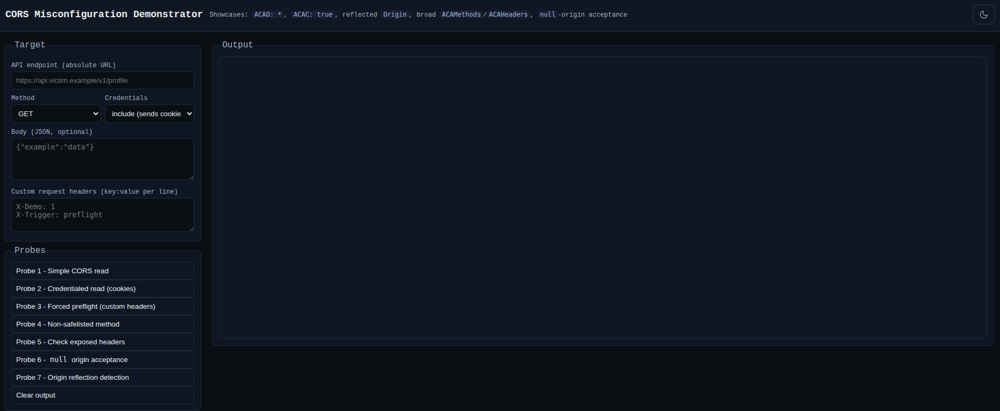
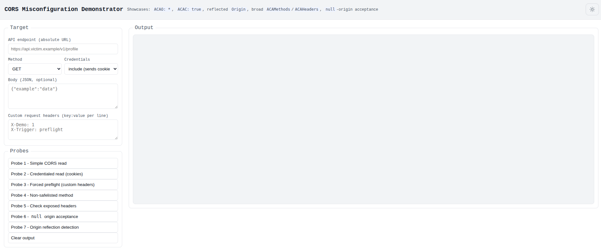

# just-in-corse

Client-side proof-of-concept to detect and demonstrate insecure CORS configurations.  

## Features

- Browser-only single-file UI (`index.html`) to test multiple CORS scenarios.
- Probes for:
  - Simple cross-origin reads
  - Credentialed requests (cookies)
  - Forced preflight via custom headers
  - Non-safelisted HTTP methods
  - Exposed response headers visibility
  - `Origin: null` acceptance via sandboxed iframe
  - Origin-reflection heuristics
- Local storage toggle for theme preference (dark/light) and minimal UI.
  

  
Dark Theme

  
  
  
  

  
  

  
Light Theme

  
  
  
  

- No backend required.

